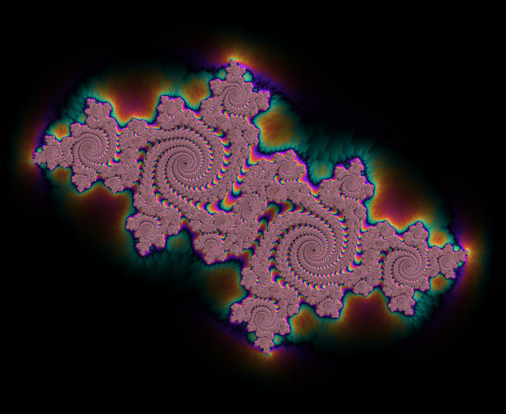
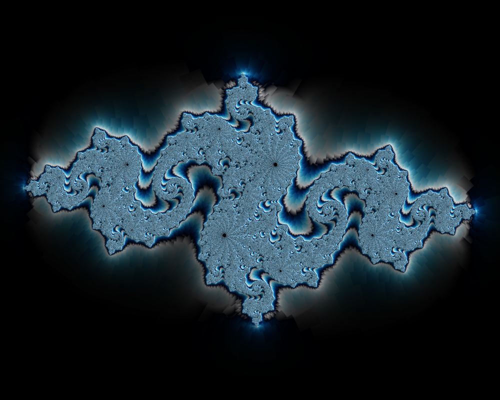
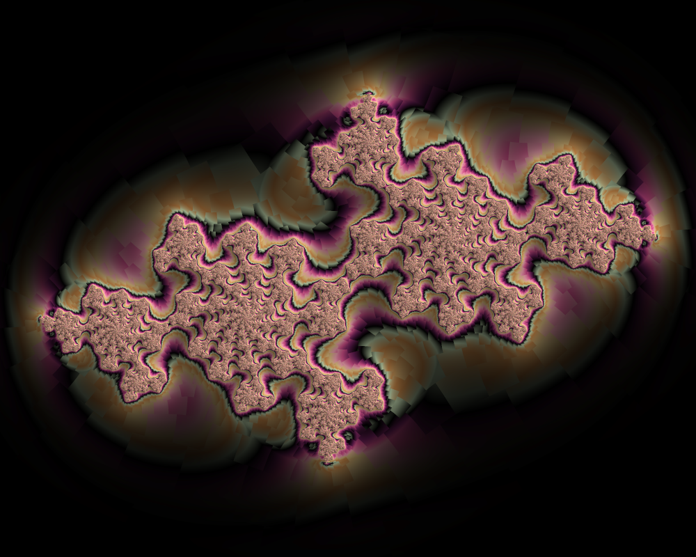

# fractal

A GPU fractal visualizer for stunning Julia & Mandelbrot art, with fully
customizable color and a one-command path to seamless 20-second loop videos.

Renders on the GPU via OpenGL/GLSL (Apple's Metal-backed OpenGL on macOS), so a
4K still at 16× supersampling renders in well under a second on Apple Silicon.



| | |
|---|---|
|  |  |
|  | *…and whatever you can dial in* |

## Why it looks good

Pretty fractals are mostly about coloring and edge quality, not the iteration
loop. This renderer layers several well-known fidelity techniques:

- **Smooth (continuous) iteration count** — fractional escape time so color
  bands flow instead of stair-stepping.
- **Orbit-trap coloring** — tracks how close each orbit passes to a point and
  maps that to hue. This is what paints rich color across the dense body of the
  set, where plain iteration banding goes flat.
- **Normal-map "fake 3D" shading** — lights the surface using the escape
  derivative, producing the feathery, embossed look of the reference art.
  ([Wikipedia: normal map effect](https://en.wikipedia.org/wiki/Plotting_algorithms_for_the_Mandelbrot_set))
- **Distance estimation** — `d = √(|z|²/|dz|²)·½·log|z|²` ([Inigo Quilez](https://iquilezles.org/articles/distancefractals/))
  fades the exterior into a clean black void and can glow the finest filaments.
- **Escape-angle decomposition** — adds hue grain along the filigree's grain.
- **Gamma-correct supersampling** — the fractal is rendered at up to 8× per
  axis and resolved down with a box filter that averages in *linear* light, so
  edges are smooth and colors don't darken at boundaries.

## Build (macOS / Apple Silicon)

Requires the Xcode command-line tools (clang), [Homebrew](https://brew.sh), and
GLFW. Video export needs ffmpeg.

```sh
brew install glfw ffmpeg
make            # builds ./fractal (arch arm64, -O3 -flto)
make test       # builds and runs the unit tests (no GPU needed)
```

The build links Apple's system OpenGL framework (no GL loader required) plus
GLFW. OpenGL on Apple Silicon runs on top of Metal and supports the GL 3.3 core
profile this project targets.

## Usage

```sh
fractal render [options]      # single still image -> PNG
fractal video  [options]      # seamless animation -> MP4 (needs ffmpeg)
fractal help                  # full option reference
```

### Stills

```sh
# The default look (bold double spirals)
fractal render -o spiral.png

# A Julia dendrite with the ice palette, deeper zoom, custom constant
fractal render --cre -0.8 --cim 0.156 -p ice --zoom 1.4 --ssaa 6 -o ice.png

# Mandelbrot seahorse valley, custom hex palette
fractal render --type mandelbrot --center-x -0.7436 --center-y 0.1318 \
               --zoom 350 -i 2000 -p "#000000,#a01a00,#ff8c00,#ffe9b0" -o seahorse.png
```

### Videos (20s loops)

Three animation modes, all built to loop seamlessly:

```sh
# rotate: the Julia constant orbits the origin -> morphs through forms
fractal video --mode rotate -d 20 --fps 30 -o loop.mp4

# zoom: smooth dive toward a target (great for Mandelbrot)
fractal video --type mandelbrot --mode zoom \
              --zoom-target-x -0.743 --zoom-target-y 0.131 --zoom-end 0.0005 -o dive.mp4

# cycle: static fractal, palette sweeps one full cycle
fractal video --mode cycle -p psychedelic -o cycle.mp4
```

### Color

Built-in palettes: `aurora` (default), `bloom`, `ember`, `fire`, `ice`,
`psychedelic`, `mono`. Or pass your own comma-separated hex list — two or more
stops, looped seamlessly:

```sh
fractal render -p "#05010d,#ff7b54,#ffd45e,#3fd0c9" -o custom.png
```

Key tuning knobs (see `fractal help` for the full list and defaults):

| Flag | Effect |
|---|---|
| `--cre`, `--cim` | Julia constant — the single biggest lever on the shape |
| `--zoom` / `--scale`, `--center-x/y` | Framing |
| `-i, --iterations` | Detail vs. speed; raise it for deep zooms |
| `--color-density` | Palette cycles per iteration (band frequency) |
| `--trap-color`, `--trap-x/y` | Orbit-trap strength and location (body color) |
| `--angle-color` | Escape-angle hue grain (keep low to avoid speckle) |
| `--falloff` | How tightly color hugs the set before fading to black |
| `--shading`, `--light-angle/height` | Normal-map emboss |
| `--glow` | Distance-estimate filament glow |
| `--ssaa` | Supersampling per axis (1–8); 4 = 16 samples/px |
| `--saturation`, `--gamma`, `--inside` | Final grade and interior color |

## How it's organized

```
src/
  config.h         Plain-data params (RenderConfig, VideoConfig) — no GL
  fractal_math.h   CPU reference of the iteration (mirrors the shader; testable)
  palette.{h,cpp}  Hex/named palette parsing -> RGB gradient texture data
  cli.{h,cpp}      Argument parsing -> config (no I/O, fully testable)
  renderer.{h,cpp} The only OpenGL code: context, FBOs, shaders, readback
  gl.h             Single point of GL inclusion (macOS core profile)
  main.cpp         Wires it together; PNG via stb, MP4 via an ffmpeg pipe
shaders/
  fullscreen.vert  Full-screen triangle (no vertex buffer)
  fractal.frag     The fractal math, coloring, shading, traps
  downsample.frag  Gamma-correct supersampling resolve + final grade
tests/             Dependency-free unit tests for the GL-free units
```

The GPU is the production renderer; `fractal_math.h` re-implements the same
escape-time and distance-estimate math on the CPU purely so the algorithm can
be unit tested deterministically without a graphics context.

## Tests

```sh
make test
```

Covers hex/palette parsing and gradient generation, the escape-time and
distance-estimation math (membership, smoothness, monotonicity), and CLI
parsing including every error path. The renderer itself is validated by
rendering (see the gallery) since it needs a live GL context.

## License

MIT — see [LICENSE](LICENSE).
