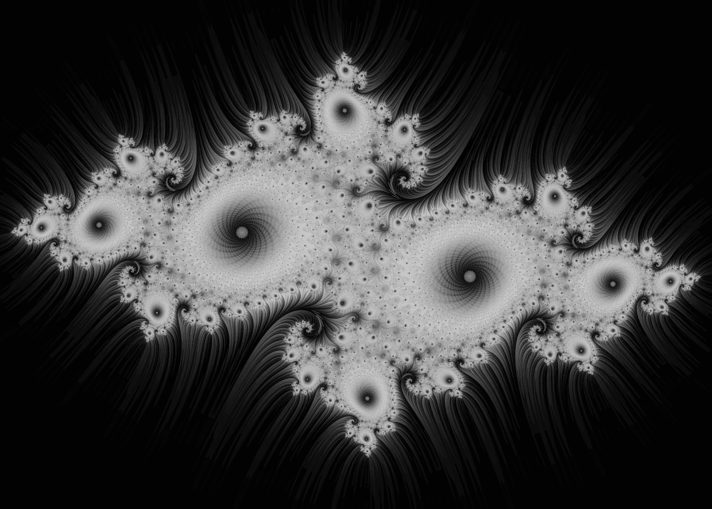
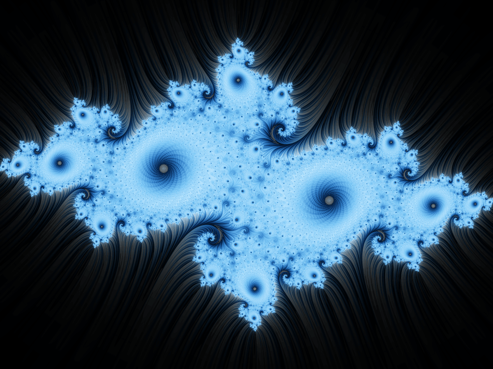
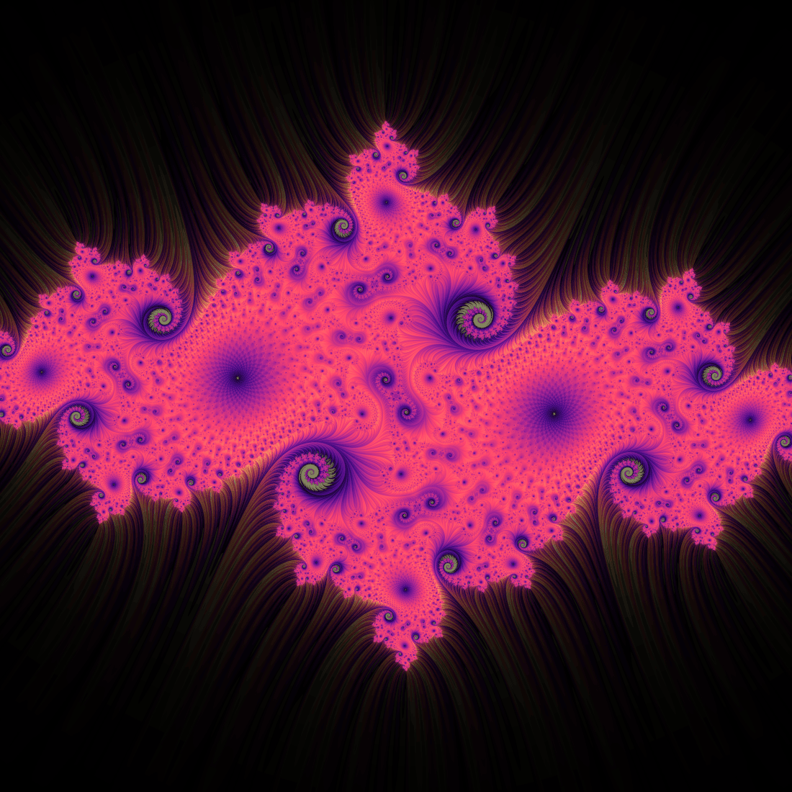
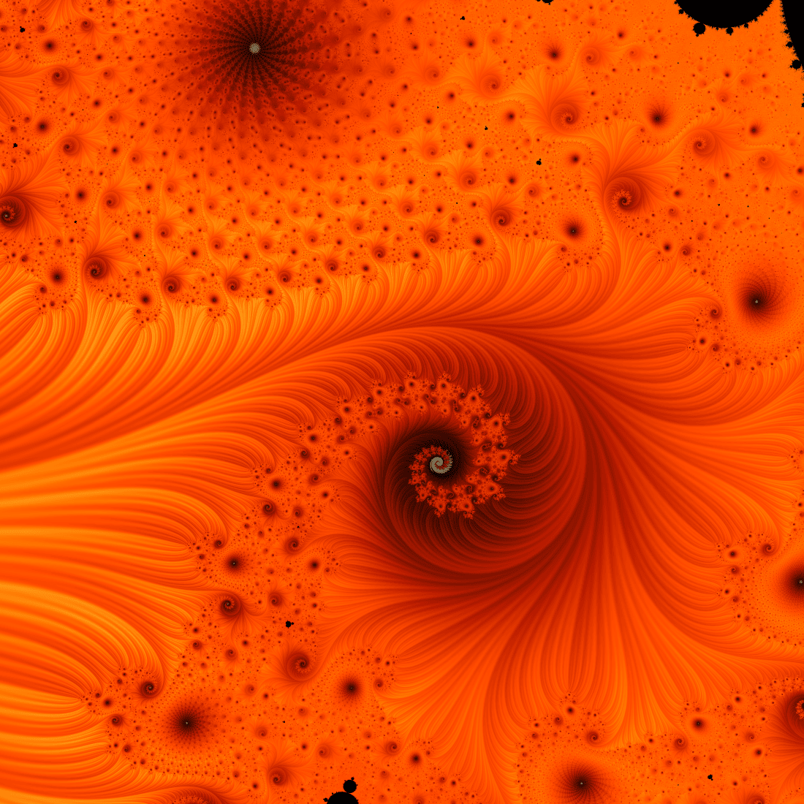

# fractal

A little command-line tool for rendering Julia and Mandelbrot sets as stills
and seamless loop videos. It runs the fractal math on the GPU (OpenGL/GLSL), so
a 4K still at 16x supersampling comes back in well under a second on Apple
Silicon.

The coloring is the interesting part — see [how it works](#how-it-works).



| | |
|---|---|
|  |  |
|  | *…or whatever you can dial in* |

## Build

macOS / Apple Silicon. You need clang (Xcode command-line tools), GLFW, and
ffmpeg if you want video:

```sh
brew install glfw ffmpeg
make            # -> ./fractal
make test       # unit tests, no GPU needed
```

It links Apple's system OpenGL (which runs on Metal) plus GLFW — no GL loader
to mess with.

## Usage

```sh
fractal render [options]      # one still image -> PNG
fractal video  [options]      # seamless loop -> MP4
fractal help                  # every option
```

Some stills to start from:

```sh
# default look (grayscale stripe-average relief)
fractal render -o spiral.png

# same thing in blue, zoomed into a spiral
fractal render --cre -0.7269 --cim 0.1889 --scale 1.1 -i 4000 -p frost -o frost.png

# mandelbrot seahorse valley
fractal render --type mandelbrot --center-x -0.74364388703 --center-y 0.13182590421 \
               --zoom 350 -i 2000 -p ember -o seahorse.png
```

A 20-second loop:

```sh
# the julia constant orbits the origin, so it loops perfectly
fractal video --mode rotate -d 20 --fps 30 -o loop.mp4

# or dive into the mandelbrot
fractal video --type mandelbrot --mode zoom \
              --zoom-target-x -0.743 --zoom-target-y 0.131 --zoom-end 0.0005 -o dive.mp4
```

Palettes are dark→bright ramps so detail stays readable instead of turning into
rainbow mush: `noir` (default), `frost`, `magma`, `viridis`, `ember`, `ice`,
`fire`, `aurora`, `bloom`, `psychedelic`, `mono`. Or pass your own hex list,
e.g. `-p "#00040c,#2f6fb0,#eaf7ff"`.

The knobs worth knowing (`fractal help` has the rest):

| flag | what it does |
|---|---|
| `--cre`, `--cim` | the Julia constant — biggest lever on the shape |
| `--zoom` / `--scale`, `--center-x/y` | where you're looking |
| `-i, --iterations` | more = finer filaments resolved (deep zooms need a lot) |
| `--stripe-freq`, `--stripe-contrast` | the relief texture |
| `--color-density` | iteration-layer ramp; `0` = stripe layer only |
| `--stripe-color` | stripe overlay weight; `0` = iteration layer only |
| `--bloom` | luminous glow on bright areas (`0` = off) |
| `--shading`, `--specular` | optional height-field lighting (off by default) |
| `--ssaa` | supersampling per axis (1–8) |

## How it works

Two layers, combined per pixel:

1. **Iteration layer** — standard escape-time, mapped so the fast-escaping
   exterior goes dark and the slow-escaping filaments stay bright. This is what
   draws the structure and the fine dendrite tendrils threading into the black.
2. **Stripe Average Coloring** — averages `½ + ½·sin(s·arg z)` along the orbit,
   then interpolates by the fractional escape count to kill the banding. The
   result is a smooth field whose contours follow the fractal's flow, so it
   reads as 3D relief without any actual lighting. This is Jussi Härkönen's
   2007 method; I followed Phil Thompson's
   [writeup](https://philthompson.me/2023/Stripe-Average-Coloring.html), which
   also explains the overlay idea.

The iteration layer gates the stripe layer: empty gaps go black, structure
shows the full relief, and the tendrils carry the texture out into the void.
Set `--stripe-color 0` to see the iteration layer alone, or `--color-density 0`
for the stripe layer alone.

A couple of other things going on:
- **bloom** — the bright filaments get blurred and screen-blended back in, so
  they glow a little (on by default; `--bloom 0` turns it off)
- optional **height-field lighting** — treats the relief as a height map and
  lights it with diffuse + specular (Blinn-Phong) for a polished, lit look.
  Off by default; `--shading 0.3 --specular 0.6` to try it
- exterior fade and optional filament glow use Iñigo Quilez's
  [distance estimate](https://iquilezles.org/articles/distancefractals/)
- supersampling is resolved in linear light so edges don't darken
- `magma` and `viridis` are the matplotlib colormaps (perceptually uniform,
  which is why they never look muddy)

## Credits

- Stripe Average Coloring — Jussi Härkönen (2007), via [Phil Thompson](https://philthompson.me/2023/Stripe-Average-Coloring.html)
- Distance estimation — [Iñigo Quilez](https://iquilezles.org/articles/distancefractals/)
- PNG writing — [stb_image_write](https://github.com/nothings/stb) (Sean Barrett)
- [GLFW](https://www.glfw.org/) for the GL context, [ffmpeg](https://ffmpeg.org/) for video

## License

MIT — see [LICENSE](LICENSE).
